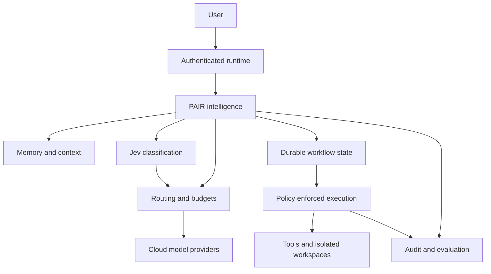

# PAIR — Complete Implementation Plan

> **For agentic workers:** Use `superpowers:executing-plans` to implement this plan task by task. Use subagent-driven development only when explicitly selected by the owner. Steps use checkboxes for tracking.

**Goal:** Build a cloud-model personal AI runtime that Devesh uses daily for engineering, research, planning, and reliable memory, with measurable quality and enforced spending limits.

**Architecture:** Start with a pinned OpenClaw baseline, subject to a source audit. Keep upstream changes small and implement PAIR intelligence through supported extensions or a separate service. Jev supplies narrow classification signals to a deterministic router. Policy, budget enforcement, provenance, and verification surround every model-driven workflow.

**Tech stack:** OpenClaw's existing language and build system for adapters; Rust/Axum for the PAIR intelligence service if a separate service is justified; PostgreSQL, optional pgvector, Docker Compose, Jev cloud classification, cloud generation, structured tracing. No local inference.

**Spec:** Sections 1–14 of this document are the product and architecture specification. Sections 15–20 are the implementation and operating plan.

**Prepared:** 2 October 2026. **Revision:** 2 — Jev-assisted cloud routing. **Status:** Ready for Phase 0 discovery; not a claim that upstream extension points, subscriptions, or deployments have been verified.

## Global constraints

- All generation, embedding, and reranking inference must use cloud services. No local Ollama server, GPU requirement, or local-model fallback.
- The first release is private and single-user, with Asia/Kolkata as the scheduling timezone.
- OpenClaw is the selected candidate foundation; adoption is conditional on the Phase 0 audit.
- Never treat Claude Pro as an API entitlement. Any SDK credit, supported authentication flow, or allowance must be verified before use.
- Model output cannot override permissions, budgets, tool allowlists, or data boundaries.
- Jev is a replaceable cloud classifier. Its confidence is not downstream task-success probability, and it cannot authorize actions.
- Jev requests count toward the same spending and data policies as generative model calls.
- External mutations require approval unless a specific standing policy authorizes that exact action class.
- No autonomous purchase of credits or automatic budget increase.
- Employer repositories and communications remain disconnected until their use with each cloud provider is authorized.
- Every accepted memory must point to a source. Derived inferences are explicitly labeled.
- Keep upstream upgrade compatibility and data exportability throughout development.

## Review focus

1. Concurrent requests must not overspend the shared budget.
2. Retried or resumed jobs must not repeat external side effects.
3. Retrieved instructions from email, webpages, and repositories must remain untrusted data.
4. Contradictory or stale memories must preserve source history without silently becoming current facts.
5. Provider failure or ambiguous billing must stop safely, preserve progress, and never silently switch to a disallowed provider.

---

## 1. Product definition

PAIR means **Personal AI Runtime**. It should reduce the time spent reconstructing context, investigating code, collecting research, and organizing commitments.

### Primary user journeys

| Journey | Input | Expected result |
|---|---|---|
| Daily planning | “What should I focus on today?” | Three source-backed priorities, meetings, blockers, and useful delegated work |
| Engineering | “Investigate this issue in my repository” | Relevant context, evidence, proposed change, verified patch, reviewable diff |
| Decision recall | “Why did we choose this design?” | Current decision, original rationale, sources, superseded alternatives |
| Research | “Compare these approaches” | Evidence ledger, supported comparison, uncertainties, cited report |
| Daily review | “Wrap up today” | Completed work, candidate memories, open loops, tomorrow's starting point |
| Learning | “What should I study tonight?” | A concrete session connected to active goals and recorded progress |

### Release scope

**V1:** Private authenticated UI or existing channel; conversations; cloud inference; source-backed memory; context compiler; bounded routing; read tools; supervised coding; research; morning and evening workflows; audit, backups, and export.

**V1.1:** Gmail/Calendar ingestion, richer goals, standing approvals, calibrated routing, operational improvements.

**Later:** Knowledge graph, Temporal integration, additional channels, multi-user support, product commercialization.

**Excluded:** Local models, Kubernetes, Kafka, fine-tuning, unrestricted background agents, voice, native mobile app, and a new UI before the inherited interface proves inadequate.

## 2. What “world class” means

These are proposed release targets, not current performance claims. Measure them using a held-out evaluation set and real usage.

| Dimension | Initial release gate |
|---|---|
| Provenance | 100% of accepted memories have accessible source references |
| Recall | At least 90% correct answers on 50 held-out decision/fact queries, with source support |
| Unsupported recall | At most 5% unsupported factual answers; unknowns explicitly acknowledged |
| Policy | Zero unauthorized external mutations in the policy test suite |
| Budget | Zero overspend beyond the application reservation ceiling in concurrency tests |
| Coding | At least 8 of 10 scoped benchmark tasks satisfy acceptance checks and human review |
| Recovery | Interrupted jobs resume or report a clear terminal state without duplicated side effects |
| Traceability | Every model call, routing decision, tool execution, and approval is traceable |
| Daily usefulness | Used at least 5 days per week for two consecutive weeks |
| Personal value | Owner records at least 3 hours saved weekly after the stabilization period |

Unit tests passing alone do not establish semantic correctness or security. Coding acceptance includes requirement coverage and review. Model confidence is not a calibrated success probability.

## 3. Foundation and reuse strategy

### OpenClaw adoption gate

Before forking, record the exact commit SHA and inspect the actual source and documentation for:

- License, third-party notices, dependency licenses, and trademark boundaries.
- Build requirements, security advisories, maintenance activity, and release process.
- Provider API support, tool execution, sandbox behavior, credentials, and channel authentication.
- Extension hooks for context, memory, model selection, telemetry, and workflow persistence.
- Existing tests, upgrade mechanisms, data formats, and export behavior.

The earlier conversation described these capabilities, but this document does not treat them as source-audited facts. Record each as **verified**, **partial**, or **missing** with file paths and evidence.

### Preferred integration order

1. Supported configuration and plugins.
2. A PAIR service behind a documented adapter.
3. A small, isolated upstream patch with contract tests.
4. Replace the foundation only if a critical requirement cannot be met safely.

Maintain `upstream`, pin releases, and keep a patch inventory. Avoid deleting upstream provider code merely to exclude local inference; reject local endpoints in PAIR policy and deployment configuration.

### Projects to study

| Candidate | Study objective | Evidence required before adoption |
|---|---|---|
| OpenClaw | Runtime, integrations, policy, extension lifecycle | Source audit and integration spike |
| MIRA | Memory, proactive workflows, Rust decomposition | Verify repository, license, implementation, tests |
| Mimir | Inspectable memory and context budgets | Verify repository and actual behavior |
| PydanticAI/Temporal examples | Durable agent workflow patterns | Supported versions, failure tests, operational cost |

Do not copy incompatible licensed code. Architectural ideas and independently implemented behavior can be evaluated separately. Precise licensing decisions require the actual license texts and intended distribution model.

## 4. Architecture



### Ownership

| Component | Owner | Responsibility |
|---|---|---|
| Gateway, sessions, channels | Upstream where verified | Authentication, interaction, transport |
| Provider transport and transient failover | Upstream where suitable | Streaming, supported authentication, transient failures |
| Memory and context | PAIR | Provenance, retrieval, contradiction handling, context budgets |
| Model choice and budget | PAIR | Approved provider selection, reservation, outcome-based escalation |
| Tool permissions | PAIR plus runtime enforcement | Evaluate every execution request against deterministic policy |
| Workflows | PAIR over inherited scheduler | Checkpoints, approvals, idempotency, retries |
| Execution isolation | Verified sandbox mechanism | Workspace, network, process, filesystem limits |
| Observability and evaluation | PAIR | Correlated events, quality evidence, cost accounting |

Do not create a Rust service solely for language preference. Phase 0 must prove that the service boundary improves isolation or maintainability. If supported TypeScript plugins meet V1 requirements, implement adapters there and postpone the service.

## 5. Cloud model and authentication strategy

### Initial providers

- TypeSafe Jev is the initial classification candidate, accessed through its cloud API. Begin with task intent and difficulty in shadow mode. Keep generation and classification adapters separate.

- Ollama Cloud is a preferred candidate for routine and strong inference, subject to verified API access, usage limits, model availability, and permitted automation.
- Claude is the preferred premium candidate through a supported API or explicitly supported SDK authentication flow.
- Claude Code remains a separate interactive development tool; do not assume its subscription grants server automation rights. Revision note 2026-10-03: the owner's own subscription may be used through the unmodified `claude` CLI, for one owner on their own host only (verified against Anthropic's published terms, see docs/provider-billing.md); API-key billing stays the mode for anything else.
- Optional alternative cloud provider only after measured reliability or quality needs justify it.

Use exact model IDs and provider versions from verified catalogs. Never route by an ambiguous alias without recording the resolved model.

### Provider registry

Each entry records model ID, endpoint, supported modalities, context limit, output limit, tools/structured-output support, observed latency, price version, data policy, allowed data classes, quota, and health.

Maintain a billing verification sheet: account, entitlement, rate/allowance, reset period, expiration, token accounting, overage behavior, and date checked. **Do not depend on the earlier claimed $20 SDK credit or $40 total until verified.**

Unknown pricing means automatic paid execution is disabled until configured. Fixed subscription charges and marginal usage costs appear separately in the dashboard.

## 6. Routing and budget controls

### Routing algorithm

1. Detect deterministic tasks and run bounded tools without an LLM.
2. Apply hard constraints: allowed provider, data class, required capabilities, context fit, availability, and budget.
3. Classify intent and difficulty using Jev when policy permits. In shadow mode, record its recommendation while the baseline executes; in active mode, apply only evaluation-approved routing rules. On classifier failure or ambiguity, use the configured baseline.
4. Compile context and estimate input plus maximum output usage.
5. Atomically reserve the maximum configured spend before dispatch.
6. Execute and verify against the task's output contract.
7. Repair once for an actionable failure; escalate once only if justified and affordable.
8. Reconcile actual usage, record outcomes, and release unused reservation.

Maximum model attempts per task: **3 total**, including repair and escalation. Maximum tool calls: **20** by default. Maximum interactive workflow duration: **15 minutes**; research: **30 minutes**. Any continuation needs a new explicit policy decision.

Start with deterministic rules and Jev in shadow mode. Learn routing only after enough labeled data exists; do not turn 20 successful examples into a “99% quality” claim. Use held-out evaluation, confidence intervals, and controlled exploration before changing the baseline.

### Initial configurable caps

These are owner budget proposals, not vendor price estimates:

```yaml
budget:
  currency: USD
  metered_monthly_cap: 20.00
  metered_daily_cap: 1.00
  classifier_monthly_subcap: 1.00
  default_task_cap: 0.10
  research_task_cap: 0.50
  coding_task_cap: 1.00
  auto_top_up: false
execution:
  max_model_attempts: 3
  max_tool_calls: 20
  interactive_timeout_minutes: 15
  research_timeout_minutes: 30
schedule:
  timezone: Asia/Kolkata
  morning: '07:30'
  review: '22:30'
```

Reservations include output limits, known tool charges, retries, and applicable cache prices. Use integer currency units, not floating-point arithmetic. Parallel requests must serialize reservations. Interrupted calls with unknown charges retain an unresolved reservation until reconciled; never assume zero cost.

Provider-side spending limits are a second defense. An application cannot guarantee final provider invoices when prices, charges, or usage reports are incomplete; expose that limitation clearly.


### 6.1 Jev integration specification

**Decision:** Use Jev for narrow classifications; keep PAIR responsible for selecting models, enforcing policy, and verifying outcomes. The official documentation supports intent routing and typed decisions. Integration success has not yet been measured on PAIR tasks.

**Verified documentation snapshot, 2 October 2026:** `jev-1.13.0`; direct API input price $0.042 per million tokens, output free; text input; 64k total request limit and 32k for state plus the longest question. Rate limits can change. Pin the version and recheck prices before paid execution. Sources are listed in Section 21.

#### First classification contract

Send a compact, permitted state containing the current request, a short recent-context summary, project type, and available workflow categories. Exclude credentials, full repositories, entire mailboxes, and irrelevant conversation history. Context is necessary for follow-ups such as “do it” or “same as yesterday”; the isolated last message is insufficient.

Ask two independent questions initially:

| Field | Allowed labels | Meaning |
|---|---|---|
| `intent` | `coding`, `research`, `planning`, `memory_recall`, `transformation`, `mixed`, `uncertain` | Which workflow best matches the current objective? |
| `difficulty` | `routine`, `substantial`, `deep`, `uncertain` | Does the request require mechanical work, bounded reasoning, or complex architectural/multi-step reasoning? |

Describe each label explicitly with positive examples and boundary cases. Treat mixed requests conservatively; the generative planner may decompose them. Jev does not generate arbitrary plans, explanations, or extracted memory prose.

The internal normalized response is:

```typescript
interface TaskClassification {
  modelVersion: string;
  questionVersion: string;
  intent: string;
  difficulty: string;
  intentProbabilities: Record<string, number>;
  difficultyProbabilities: Record<string, number>;
  intentConfidence: number;
  difficultyConfidence: number;
  inputTokens: number;
  latencyMs: number;
  requestId: string;
}
```

This is a PAIR contract, not a literal TypeSafe API response schema. Map it from the verified SDK or HTTP response. Validate labels and numeric ranges at the adapter boundary. Store raw provider request IDs and normalized outputs for debugging, with sensitive text redacted.

#### Routing ownership

| Condition | PAIR behavior |
|---|---|
| Exact deterministic command | Execute its authorized handler; skip classification |
| Shadow mode | Record Jev recommendation; execute the fixed baseline |
| Evaluated routine category | Select the configured routine model if all hard constraints pass |
| Substantial/deep task | Select the corresponding evaluated model tier |
| Mixed/uncertain or below tuned threshold | Use the safe baseline; ask for clarification only when the task itself is ambiguous |
| Jev timeout, 429, malformed response, or outage | Fall back to the baseline without relaxing policy or buying credits |
| No eligible model within budget | Pause with a clear budget/capability explanation |

Do not ask Jev which vendor is “best.” It classifies task properties; PAIR maps those properties to measured model capabilities and current prices. Start with a 1-second classification deadline and no synchronous classifier retry on the interactive path. Measure and adjust the deadline using observed p95 latency.

A successful task has at most one initial classifier call plus up to three generation attempts. Classifier calls are accounted separately from generation attempts but share the overall workflow budget. Additional classification uses remain disabled in V1 until explicitly enabled and bounded.

#### Confidence and security

TypeSafe's Choice confidence is a normalized statistic derived from the top option probability. A confidence value of 0.95 is not proof of 95% end-to-end task success. Set thresholds separately for each question and pinned version using a calibration split. Recalibrate after changing labels, criteria, model version, or traffic distribution.

Jev cannot grant permissions, establish that code is safe, approve a payment, prove a citation correct, or enforce a spending ceiling. The vendor documents susceptibility to adversarial content and reduced accuracy with irrelevant state. Its optional future relevance and verification classifications are advisory signals with independently tested downstream behavior.

#### Evaluation and activation

Create 100 owner-representative requests: 30 coding, 20 research, 15 planning, 15 recall, 10 transformation, and 10 mixed/ambiguous. Include typos, shorthand, follow-ups, Hinglish, misleading complexity cues, and injected instructions. Each case has a human-reviewed intent label, difficulty rubric, expected workflow, data class, and task acceptance check.

Use 60 cases for criteria development and calibration and freeze 40 as held-out cases. Compare:

1. Fixed generative model baseline.
2. Deterministic rules plus the baseline.
3. Jev-assisted model routing.

Measure intent accuracy, ambiguity handling, downstream task acceptance, under-routing, total cost with retries, p50/p95 latency, and escalation frequency. Every routed task must be run through the downstream workflow: classification accuracy alone is insufficient.

**Pilot activation targets:** at least 90% intent accuracy on held-out cases; no policy bypass; no loss of observed downstream acceptance versus the baseline; at least 15% lower variable cost per accepted task; classifier p95 within 1 second on representative traffic. These are engineering gates, not statistical proof of equivalence. Forty held-out examples are too few for strong generalization claims.

Run shadow mode for at least 7 days and 100 eligible real requests. If traffic is lower, extend the period. Activate only validated categories behind a feature flag; retain a one-click baseline fallback. Revert on a policy violation, repeated under-routing, or a rolling accepted-task cost increase. Store rejected routing changes as evaluation results rather than silently tuning against the held-out set.

#### Cost and expansion

At the documented rate, 10,000 requests with 1,000 total input tokens each cost approximately **$0.42** for Jev input alone. This excludes downstream generation, retries, hosting, and taxes. Include state and question text in token accounting. Allocate an initial **$1/month classifier sub-cap inside the existing $20 metered cap**, rather than adding a new uncapped budget.

After routing proves useful, separately evaluate memory-type classification, candidate relevance, contradiction flags, and evidence-support triage. Generative extraction still proposes memory text; Jev can classify or evaluate bounded candidates. Do not enable every classification on every request.

## 7. Memory system

### Types

Facts, preferences, projects, people, decisions, procedures, goals, events, commitments, and open loops. Raw conversations remain sources; they do not automatically become truth.

### Lifecycle

`candidate → accepted → superseded / expired / rejected`

Extraction creates candidates. Deduplication compares normalized content and source identity. Contradiction detection flags competing claims. The inbox presents the proposed fact, evidence, reason, and affected records.

Automatically accept only low-risk explicit preferences and observations under a documented policy. Require review for inferred identity, sensitive facts, architecture decisions, or contradictions. A webpage cannot change the user's preferences or standing permissions.

Use timestamps for observation and validity separately. Preserve decision history. Repetition increases retrieval relevance but does not prove truth. Decay changes retrieval ranking; it must not erase durable decisions without retention policy.

### Database schema

| Table | Required fields and constraints |
|---|---|
| `sources` | ID, kind, external ID, revision/hash, captured time, data class, URI, deletion state |
| `conversations`, `messages` | Session, role, content reference, timestamps; unique message identity |
| `memories` | ID, type, status, content, project, valid time range, confidence label, importance, supersedes ID |
| `memory_evidence` | Memory ID, source ID, exact span/reference, extraction version |
| `memory_candidates` | Proposed content, evidence, dedupe key, contradiction links, review state |
| `projects`, `goals`, `open_loops` | Owner, status, relationships, due time, evidence |
| `memory_chunks` | Memory/source ID, text, embedding model/version, dimensions, search vector |
| `workflow_runs`, `workflow_steps` | State, attempts, checkpoint, lease, result, idempotency key |
| `approvals` | Actor, exact payload hash, scope, expiry, decision, consumed time |
| `model_calls` | Provider/model, usage, route reason, price version, latency, verification |
| `budget_reservations`, `budget_ledger` | Task, amount, period, state; unique reconciliation identity |
| `tool_executions`, `audit_events` | Request identity, policy version, approval, outcome, redacted metadata |
| `eval_cases`, `eval_results` | Dataset version, expected behavior, model/config version, scores |

All relationships use explicit foreign keys where applicable. Changes to accepted memories and approvals create audit events. Embeddings are derived indexes and can be rebuilt. PostgreSQL is authoritative for structured state; human-readable Markdown exports provide inspection and portability without creating a second writable source of truth.

### Retrieval

Filter by project, source visibility, validity, and deletion state first. Combine structured lookup, full-text search, and optional cloud embeddings. Merge using reciprocal rank fusion; rerank only when measured benefit justifies cost. Return at most 8 memory items by default, each with evidence.

Start with structured and full-text retrieval; add cloud embeddings only after an evaluation proves a meaningful recall gain. Redact or reject prohibited content before cloud embedding.

## 8. Context compiler

Input: task, selected model, recent messages, permitted memory candidates, tool state, and output contract. Output: typed sections plus token accounting and omitted-item reasons.

Example maximum input allocation for a coding task:

| Section | Initial token budget |
|---|---:|
| System and policy summary | 800 |
| Task and output contract | 700 |
| Project context | 1,200 |
| Decisions and memories | 1,200 |
| Code and tool results | 5,000 |
| Recent conversation | 1,500 |
| Tool schemas | 800 |
| **Total input target** | **11,200** |

These are tunable ceilings. Reserve output and reasoning capacity according to the provider's actual accounting. Never trim the current objective, policy, or output contract to retain older conversation. Label external content with source and trust class. Persist a context manifest containing IDs, hashes, token counts, and exclusions; avoid storing sensitive full prompts in hosted telemetry by default.

## 9. Tool policy and execution

| Action | Default behavior |
|---|---|
| Permitted read/search | Automatic, audited |
| Local edit in isolated workspace | Automatic within task scope, audited |
| Draft or local commit | Automatic within task scope |
| Send message, push, create PR, modify event | Approval or an explicit standing rule |
| Merge, deployment, destructive operation, financial action | Explicit action-specific approval |

Evaluate resolved paths, symlinks, executable, arguments, destination, and data class. Avoid accepting “safe command” labels generated by the model. Shell access is limited to an isolated workspace with time, output, resource, and egress limits.

Sandbox workers cannot access the host Docker socket, broad host mounts, cloud administrative credentials, or unrelated workspaces. Inject narrowly scoped credentials only when needed. Read operations can still leak data; network destinations are policy-controlled.

Approval binds to the exact operation payload hash and expires after 24 hours. Modified payloads require new approval. Recheck permissions at execution time. Use idempotency keys where providers support them; otherwise reconcile remote state before retrying ambiguous side effects.

## 10. Workflows

### Engineering

Issue/input → inspect repository → compile context → propose plan → bounded isolated implementation → requirement tests → lint/type/build checks → review → draft result → approved external action.

Use one branch/worktree per task. Stop if the repository changes underneath an active task. Test failures do not automatically imply a premium model is needed; distinguish environment failures from implementation defects. Passing tests does not waive review for sensitive changes.

### Research

Scope → queries → source discovery → capture source versions → deduplicate → extract evidence → compare claims → synthesize → citation validation → save report → propose memories.

Each claim links to supporting text and source date. Reject invented URLs. A citation existing is insufficient; verify that it supports the nearby claim. Mark unavailable sources and conflicting evidence.

### Daily planning and review

Morning: collect permitted calendar/task/project inputs, identify deadlines and blockers, produce three priorities and bounded delegation opportunities.

Evening: summarize actual recorded work, propose decisions/events, identify unresolved commitments, and prepare tomorrow's context. Do not infer completion from intent. Start scheduled routines only after manual versions pass their checks.

### Durability

Persist `queued`, `running`, `waiting_approval`, `succeeded`, `failed`, `cancelled`, and `interrupted` states. Workers claim leases; checkpoint after completed steps; retry transient failures with capped backoff. External side effects use a durable intent record and reconciliation.

Start with PostgreSQL-backed jobs. Introduce Temporal only if long approvals, multi-day runs, or complex recovery justify the extra service. Temporal does not remove the need for idempotent activities.

## 11. Deployment and operations

Initial shape: one private cloud deployment using Docker Compose. Components: runtime, PAIR service if needed, PostgreSQL, isolated workers, reverse proxy, and encrypted backup job. No GPU or local inference dependency.

Sizing is determined during Phase 0 using the actual upstream build and worker footprint. Select a host after comparing verified prices, data region, memory, storage, backup support, and isolated execution requirements.

- Keep database private; expose only authenticated application ingress.
- Separate staging and production credentials and data.
- Health checks cover readiness, database migrations, queue backlog, and provider availability.
- Use immutable image tags and a documented rollback procedure.
- Back up PostgreSQL and source artifacts daily; retain 7 daily and 4 weekly copies initially.
- Target RPO: 24 hours; RTO: 4 hours. Prove both with a restore drill.
- Export conversations, memories with evidence, goals, configuration, and billing ledger.
- Retention defaults: detailed model/tool payloads 30 days; raw imported sources 90 days unless pinned; decisions until explicit removal.
- Source deletion invalidates derived memories and indexes. Apply deletion to backups through documented retention expiration.

## 12. Observability and evaluation

Correlate request, workflow, step, model call, tool call, and approval IDs. Record tokens, estimated and reconciled cost, quota consumption, latency, retries, retrieval sources, route reasons, verification, and user corrections.

Use structured local/server logs first. Optional hosted tracing requires explicit data classification and redaction. Self-hosted Langfuse is deferred unless its operational footprint is justified.

Dashboard: usage by provider and task, fixed versus variable expense, reservation balance, escalations, quality by task, memory recall failures, unauthorized-action blocks, queue health, and time saved.

Avoid unsupported “85% savings” displays. Compare against a replayed equivalent-quality baseline and include retries, subscriptions, and tool charges.

Evaluation set: 30 routine/extraction tasks, 20 research tasks, 20 engineering tasks, 50 memory queries, 30 policy/injection cases, and 10 crash/retry scenarios. Separate development and held-out cases; version all prompts, rubrics, and datasets. Human review anchors automated judging.

## 13. Costs

Monthly total = subscriptions + metered generation + embeddings/reranking + search/tool fees + hosting + storage/backups + telemetry + taxes.

The prior $40/month estimate is a hypothesis, not a commitment. Start with existing subscriptions, zero assumed SDK credit, a proposed $20 metered cap, and separately approved hosting. Verify allowances before purchase. Measure task-level all-in costs for two weeks before adding providers.

## 14. Delivery schedule

Assumption: 15–20 focused engineering hours weekly. Eight weeks provides 120–160 hours for a usable V1; the full backlog may take 10–12 weeks if upstream integration or authentication is difficult. Reserve approximately 20% of capacity for stabilization.

| Phase | Window | Exit milestone |
|---|---|---|
| 0: Audit | Days 1–3 | Foundation, provider authentication, hooks, and deployment validated |
| 1: Usable runtime | Week 1–2 | Authenticated cloud conversation, traces, policy, budgets |
| 2: Memory/context | Week 3–4 | Evidence-backed cross-session recall and inspectable inbox |
| 3: Routing/evals | Week 5 | Jev comparison, bounded escalation, cost dashboard; start shadow pilot |
| 4: Engineering/research | Week 6 | One real supervised coding task and verified research report |
| 5: Personal routines | Week 7 | Manual then scheduled briefing/review with permitted sources |
| 6: Reliability | Week 8 | Recovery tests, restore drill, release gates, daily use |
| Stabilization | Following 2 weeks | Corrections become evals; feature additions paused |

If scope slips, defer semantic retrieval, mail/calendar, adaptive routing, Temporal, and additional channels. Preserve policy, budgets, evidence, recovery, and backups.

## 15. Proposed file map and contracts

These are **new PAIR-owned paths**, not claims about upstream source layout. Confirm adapter paths and package commands during Task 1. Keep the upstream runtime in its own repository; the following companion layout avoids moving upstream files.

```text
pair-intelligence/
  docs/spec.md
  docs/upstream-audit.md
  docs/provider-billing.md
  docs/runbooks/
  adapters/openclaw/
  service/src/classification/{types,jev,baseline}/
  service/src/{api,policy,budget,models,memory,context,jobs,workflows,telemetry}/
  service/tests/
  migrations/
  config/
  deploy/compose.yaml
  evals/{datasets,rubrics,results}/
  scripts/check
  scripts/evaluate
```

If Phase 0 selects a plugin-only design, preserve these logical boundaries within the plugin rather than creating a duplicate service.

### Logical interfaces

| Interface | Signature/contract |
|---|---|
| Classifier | `classify(ClassificationInput) -> TaskClassification`; cloud-only, deadline-bound, versioned questions |
| Provider | `generate(ModelRequest) -> ModelResponse`; request includes model ID, messages, output limit, deadline, data class |
| Policy | `authorize(ActionRequest, PolicyContext) -> Allow / Deny / NeedsApproval`; returns policy version and reason |
| Budget | `reserve(TaskId, MaximumCost) -> ReservationId`; `reconcile(ReservationId, UsageReport) -> LedgerEntry` |
| Memory | `propose(MemoryCandidate) -> CandidateId`; `accept(CandidateId, ActorId) -> MemoryId`; `retrieve(RetrievalQuery) -> EvidenceItem[]` |
| Context | `compile(TaskContext, ModelLimits, EvidenceItem[]) -> CompiledContext` |
| Routing | `select(TaskProfile, ProviderRegistry, BudgetState) -> RouteDecision` |
| Workflow | `start(WorkflowInput, IdempotencyKey) -> RunId`; `resume(RunId) -> RunState` |
| Approval | `approve(ActionHash, ActorId, Expiry) -> ApprovalId`; approval checked and consumed at execution |

Define serialized schemas in `config/contracts.json` during Task 2. All consumers use the same schema version. HTTP boundaries authenticate both service and actor and propagate trace IDs.

## 16. Ordered implementation backlog

Each task ends with a reviewable commit and documented acceptance result. For behavior changes, create the named failing check, implement the minimal behavior, run the focused check, then run affected integration checks. Do not invent upstream test commands; Task 1 records them. PAIR wrappers provide stable commands below.

### Task 1 — Audit and integration spike

**Files:** `docs/upstream-audit.md`, `docs/provider-billing.md`, `docs/decisions/001-foundation.md`.

- [ ] Pin the upstream SHA and document license/build/security findings with exact source paths.
- [ ] Demonstrate one authenticated cloud inference through the candidate runtime.
- [ ] Demonstrate one supported context/model/tool extension point and record its contract.
- [ ] Verify billing and supported server authentication directly against official documentation and the owner's account configuration.
- [ ] Decide plugin-only versus companion service; record fallback for missing hooks.
- [ ] Commit the audit. Exit: no critical foundation assumption remains untested.

### Task 2 — Contracts and repeatable environment

**Files:** `config/contracts.json`, `deploy/compose.yaml`, `scripts/check`, `.env.example`, CI configuration.

- [ ] Define the interfaces from Section 15, typed IDs, error codes, UTC storage, and schema version 1.
- [ ] Create a boot smoke check that expects healthy authenticated services and rejects unauthenticated requests.
- [ ] Implement staging startup, migrations, health checks, and secret placeholders.
- [ ] Run `scripts/check smoke`; expect pass from a clean environment.
- [ ] Commit. Exit: another developer can boot the pinned system without undocumented steps.

### Task 3 — Policy and isolated execution

**Files:** `service/src/policy/`, `config/policy.yaml`, `service/tests/policy.*`, worker deployment configuration.

- [ ] Add checks `external_write_requires_approval`, `symlink_escape_denied`, and `unapproved_egress_denied`.
- [ ] Implement `authorize` and enforce it at the actual tool execution boundary.
- [ ] Restrict worker mounts, process lifetime, network, and credential access.
- [ ] Run `scripts/check policy`; expect all three checks and host-credential isolation to pass.
- [ ] Commit. Exit: no alternate tool path bypasses policy.

### Task 4 — Budget ledger

**Files:** `migrations/001_budget.sql`, `service/src/budget/`, `service/tests/budget.*`.

- [ ] Add checks `parallel_reservations_cannot_overspend`, `reconcile_is_idempotent`, and `unknown_usage_retains_reservation`.
- [ ] Implement transactional `reserve` and `reconcile` with integer currency units and price versions.
- [ ] Add task/day/month caps and disabled auto-top-up.
- [ ] Run `scripts/check budget`; expect no accepted reservation above the configured ceiling under concurrency.
- [ ] Commit. Exit: denied tasks never reach the provider.

### Task 5 — Provider calls, persistence, and tracing

**Files:** `service/src/models/`, `service/src/telemetry/`, conversation migrations, adapter provider hook.

- [ ] Add checks for streaming completion, cancellation, provider timeout, and disallowed local endpoints.
- [ ] Implement `generate`, conversation persistence, usage capture, and reservation reconciliation.
- [ ] Record trace IDs and redact secrets from all failures.
- [ ] Run `scripts/check providers`; use mock fixtures plus one bounded live smoke request.
- [ ] Commit. Exit: cloud-only conversations survive a restart and each call has an auditable cost state.

### Task 6 — Memory store and provenance

**Files:** memory migrations, `service/src/memory/store.*`, `service/tests/memory_store.*`.

- [ ] Add checks `accepted_memory_requires_evidence`, `supersession_preserves_history`, and `deleted_source_is_not_retrievable`.
- [ ] Implement `propose`, `accept`, source revisions, typed memory, and export.
- [ ] Run `scripts/check memory-store`; expect provenance and visibility invariants to pass.
- [ ] Commit. Exit: accepted memories are inspectable and exportable.

### Task 7 — Memory inbox

**Files:** `service/src/memory/inbox.*`, inbox adapter/UI, contradiction fixtures.

- [ ] Add checks `duplicate_candidate_is_not_duplicated`, `contradiction_requires_review`, and `untrusted_source_cannot_change_preferences`.
- [ ] Implement candidate extraction schema, normalization, deduplication, contradiction links, accept/reject/edit flows.
- [ ] Run `scripts/check memory-inbox`; expect explicit observations and inferred candidates to remain distinguishable.
- [ ] Commit. Exit: a correction preserves the original evidence and shows the active replacement.

### Task 8 — Retrieval

**Files:** `service/src/memory/retrieval.*`, full-text migration, `evals/datasets/memory.jsonl`.

- [ ] Add checks for project filtering, expired memories, conflicting decisions, and source permission changes.
- [ ] Implement structured/full-text retrieval and evidence-ranked output.
- [ ] Run `scripts/evaluate memory`; record held-out recall and unsupported-answer rates.
- [ ] Add cloud embeddings only if the incremental benchmark improves recall enough to justify data exposure and cost.
- [ ] Commit. Exit: retrieval respects current visibility and returns source spans.

### Task 9 — Context compiler

**Files:** `service/src/context/`, `config/context.yaml`, `service/tests/context.*`.

- [ ] Add checks `context_fits_model_limit`, `objective_survives_truncation`, and `external_instructions_remain_data`.
- [ ] Implement `compile`, section budgets, output reserve, trust labels, and context manifests.
- [ ] Run `scripts/check context`; verify behavior with oversized histories and tool output.
- [ ] Commit. Exit: every call can explain which context it included and omitted.

### Task 10 — Jev classifier, baseline router, and evaluation harness

**Files:** `service/src/models/router.*`, `service/src/classification/`, `config/models.yaml`, `config/jev-questions.json`, `evals/datasets/routing.jsonl`, `scripts/evaluate`, eval rubrics.

- [ ] Add checks for capability mismatch, private data, unavailable providers, and maximum three attempts.
- [ ] Implement `classify(ClassificationInput) -> TaskClassification` with pinned Jev version, normalized probabilities, usage accounting, and a 1-second deadline.
- [ ] Add checks `classifier_timeout_uses_baseline`, `invalid_label_uses_baseline`, `confidence_cannot_authorize_action`, `classifier_cost_counts_toward_budget`, and `followup_includes_relevant_context`.
- [ ] Implement `select` using hard constraints and task-category baselines. Add `disabled`, `shadow`, and `active` classifier modes; only active mode can change the selected generation tier.
- [ ] Build the 100-case dataset and frozen split specified in Section 6.1. Compare all three routing strategies using downstream acceptance, not classification alone.
- [ ] Add verification-driven repair/escalation and record route reasons.
- [ ] Run `scripts/check routing` and `scripts/evaluate baseline`; publish outcome/cost/latency results.
- [ ] Run the 7-day/100-request shadow pilot and enable only categories meeting Section 6.1 gates; otherwise retain baseline routing.
- [ ] Commit. Exit: classifier failures do not block baseline operation, and no probabilistic quality claims are presented without measured evidence.

### Task 11 — Durable job state and approvals

**Files:** workflow/approval migrations, `service/src/jobs/`, `service/tests/recovery.*`.

- [ ] Add checks `restart_resumes_checkpoint`, `expired_approval_is_denied`, `changed_payload_invalidates_approval`, and `ambiguous_side_effect_is_reconciled`.
- [ ] Implement leases, step checkpoints, `start`, `resume`, and hash-bound approvals.
- [ ] Run `scripts/check recovery` with process termination injected before and after side effects.
- [ ] Commit. Exit: restart never blindly repeats a send/push action.

### Task 12 — Repository tools and engineering workflow

**Files:** `service/src/workflows/coding.*`, repository adapter, `evals/datasets/coding.jsonl`.

- [ ] Add checks for repository mutation during a run, hidden credentials, failed acceptance tests, and scoped patch output.
- [ ] Implement issue/context/plan/worktree/edit/verify/review stages.
- [ ] Configure per-repository authoritative build and acceptance commands.
- [ ] Run `scripts/evaluate coding`; complete one real owner-controlled issue and inspect the diff.
- [ ] Commit. Exit: the result is a tested reviewable patch with no unapproved remote write.

### Task 13 — Source-grounded research

**Files:** `service/src/workflows/research.*`, evidence migrations, research fixtures.

- [ ] Add checks for unsupported citations, inaccessible sources, conflicting evidence, and injected webpage instructions.
- [ ] Implement evidence capture, synthesis, claim support validation, and report export.
- [ ] Run `scripts/evaluate research`; manually audit every factual claim in one complete report.
- [ ] Commit. Exit: report uncertainties and source limitations are explicit.

### Task 14 — Goals, commitments, and daily routines

**Files:** goal/open-loop migrations, `service/src/workflows/daily.*`, schedule configuration.

- [ ] Add checks `intent_is_not_completion`, `overdue_commitment_remains_open`, and `schedule_uses_kolkata_timezone`.
- [ ] Implement goal evidence, manual briefing, manual review, and bounded scheduled versions.
- [ ] Run `scripts/check daily`; use a week's fixture events plus manual owner review.
- [ ] Commit. Exit: the brief prioritizes actual commitments and the review only records observed completion.

### Task 15 — Optional personal integrations

**Files:** Gmail/Calendar adapters, scope configuration, integration fixtures.

- [ ] Verify account scopes and retrieve only explicitly permitted folders/calendars.
- [ ] Add checks for revoked tokens, stale events, deleted messages, and duplicate ingestion.
- [ ] Implement incremental cursors, source revision tracking, and disconnect/export controls.
- [ ] Run `scripts/check personal-integrations`; external writes remain disabled by default.
- [ ] Commit. Exit: disconnecting an account prevents future ingestion and exposes deletion choices.

### Task 16 — Operations, release, and stabilization

**Files:** `docs/runbooks/`, backup configuration, dashboard, release checklist.

- [ ] Add operational checks for full disk, provider outage, queue backlog, migration failure, and backup restoration.
- [ ] Implement alerts, rollback, export/deletion, reservation reconciliation, and restore procedure.
- [ ] Run `scripts/check release` plus held-out evaluation suites; record every unmet target.
- [ ] Perform a restore drill and policy/injection review before daily dependence.
- [ ] Use PAIR for two weeks; convert every material correction into an evaluation case.
- [ ] Commit. Exit: release gates pass or limitations are explicitly documented and accepted.

## 17. First seven working days

| Day | Focus | Concrete evidence |
|---|---|---|
| 1 | Upstream and license audit | Pinned SHA, build result, capability matrix |
| 2 | Provider/authentication spike | One cloud generation response and one bounded Jev classification; verified billing sheet |
| 3 | Extension decision and environment | Adapter contract, repeatable staging boot |
| 4 | Policy and sandbox | Denied escape/write checks, isolated read tool |
| 5 | Budget and telemetry | Parallel reservation test and traced inference |
| 6 | Conversations and minimal memory | Restart persistence and one source-backed decision |
| 7 | Owner walkthrough | Recall that decision in a new session and review a scoped repo investigation |

This first-week slice demonstrates feasibility. It does not promise autonomous coding, complete memory, and all integrations within seven days.

## 18. Risk register

| Risk | Response |
|---|---|
| Upstream hooks insufficient | Small audited adapter patch or change foundation before extensive customization |
| Subscription automation unsupported | Use supported API billing; keep interactive subscription separate |
| Cloud quota unpredictable | Quota-aware stop/fallback within policy; no auto-purchase |
| Memory poisoning | Source trust labels, inbox, contradiction review, provenance |
| Employer data exposure | Default disconnect and per-provider data classification |
| Excessive complexity | Deliver vertical slices, defer graph/Temporal/new UI |
| Jev misclassification or outage | Versioned criteria, conservative fallback, shadow pilot, category-level activation |
| Low-quality cheap model | Held-out benchmarks, verification, bounded escalation |
| Tests miss semantic defects | Human acceptance review and requirement-specific evals |
| Upgrade breaks customizations | Pinned baseline, adapter contract tests, staging upgrade rehearsal |
| Background jobs overspend | Shared reservations, bounded attempts, queue limits, kill switch |
| Service becomes unavailable | Checkpoints, provider health, backups, verified restore |

## 19. Decisions to finalize in Phase 0

- Exact OpenClaw commit, license findings, and supported adapter boundaries.
- Plugin-only versus Rust companion service.
- Cloud providers, model IDs, billing mechanisms, and permitted authentication.
- Host/region and approved fixed monthly expense.
- Interface/channel for the first release.
- Which owner-controlled repository becomes the first coding benchmark.
- Data classes allowed per provider and integration authorization.

These decisions do not block writing this plan. They gate the corresponding implementation and spending.

## 20. Definition of done and execution handoff

- [ ] Private authenticated deployment with cloud-only model access.
- [ ] Conversations and accepted memories survive restarts.
- [ ] Cross-session recall meets the held-out memory gates.
- [ ] Each model/tool action has policy, trace, and billing records.
- [ ] Jev shadow evaluation is complete; routing is active only for categories meeting the gates, or baseline-only limitations are documented.
- [ ] Classifier outage and adversarial-input checks pass without permission or budget bypass.
- [ ] Budgets hold under concurrent requests and interrupted calls.
- [ ] One real engineering task produces an accepted patch.
- [ ] One research report passes claim-by-claim evidence review.
- [ ] Briefing and review work manually before scheduled activation.
- [ ] Approvals, cancellation, retries, and recovery behave as specified.
- [ ] Backup restoration and export are demonstrated.
- [ ] Two weeks of real usage produce a documented improvement backlog.

**Recommended execution:** Native task-by-task implementation, starting with the Phase 0 audit. Review and fix the foundation before committing to deeper memory or routing work. This document authorizes no subscription purchase, external message, production deployment, or employer-data ingestion by itself.

**Reference locations to verify during Phase 0:**

- OpenClaw: https://github.com/openclaw/openclaw
- OpenClaw documentation: https://docs.openclaw.ai/
- MIRA candidate: https://github.com/Vexillon-ai/MIRA
- Mimir candidate: https://github.com/csornyei/mimir
- Ollama pricing and API documentation: https://ollama.com/pricing and https://docs.ollama.com/
- Claude documentation and account entitlements: https://platform.claude.com/docs and https://support.claude.com/
- MCP specification: https://modelcontextprotocol.io/
- Temporal documentation: https://docs.temporal.io/

These are verification targets carried forward from the discussion, not citations supporting newly audited claims.


## 21. Jev evidence and implementation reading

Official sources checked on 2 October 2026:

1. [Models, pricing, limits, and pinned versions](https://docs.typesafe.ai/models).
2. [Intent routing](https://docs.typesafe.ai/patterns/intent-routing).
3. [Confidence definitions and threshold guidance](https://docs.typesafe.ai/confidence).
4. [Jev 1.13 documented limitations](https://docs.typesafe.ai/model-jaggedness/jev-1.13).
5. [Documentation index](https://docs.typesafe.ai/llms.txt), including API, SDK, relevance, and citation-checking guides.

Use the official API/SDK schema during implementation. The Jev integration described here is proposed PAIR behavior; no live API benchmark or production integration has been completed in this planning session.
